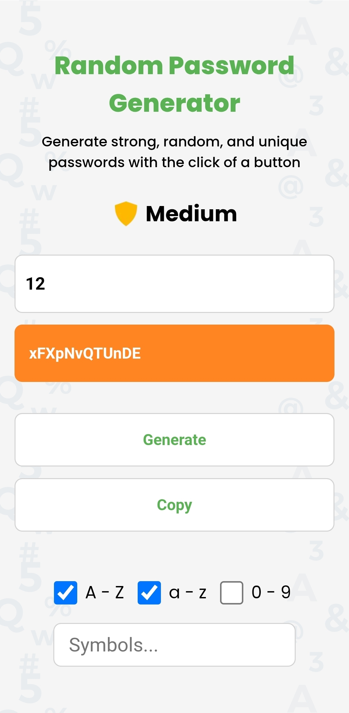

# 🔐 Random Password Generator

A modern and responsive password generator built with **HTML**, **CSS**, and **JavaScript**. Generate strong, random, and customizable passwords with support for uppercase letters, lowercase letters, numbers, and custom symbols.

## ✨ Features

* Generate secure random passwords
* Custom password length
* Include uppercase letters (A-Z)
* Include lowercase letters (a-z)
* Include numbers (0-9)
* Add custom symbols
* Password strength indicator
* One-click copy to clipboard
* Fully responsive design
* Clean and user-friendly interface

## 🚀 Live Demo

👉 **Live Website:** https://alexkonecny10.github.io/PasswordGenerator-JS/

## 📸 Preview

<p align="left">
  
</p>

## 🛠️ Technologies Used

* HTML5
* CSS3
* JavaScript
* Google Fonts

## 🚀 Getting Started

### Clone the Repository

```bash
git clone https://github.com/alexkonecny10/PasswordGenerator-JS.git
```

### Open the Project

Navigate to the project folder and open `index.html` in your browser.

No installation or dependencies are required.

## 🔒 Password Strength Levels

The password strength indicator is based on an **entropy-based calculation**.

It analyzes:
- Size of the character pool (uppercase, lowercase, numbers, symbols)
- Password length
- Estimated entropy (randomness in bits)

Higher entropy = stronger password and higher resistance to brute-force attacks.

## 📱 Responsive Design

The application is optimized for:

* Desktop
* Tablet
* Mobile devices
